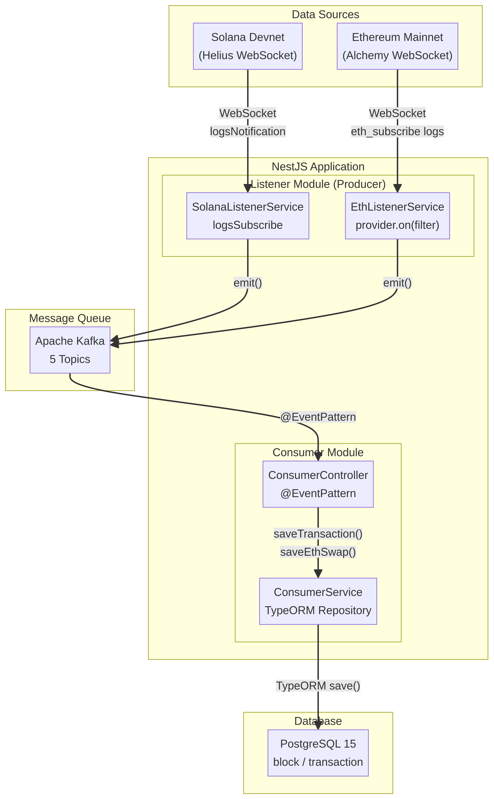
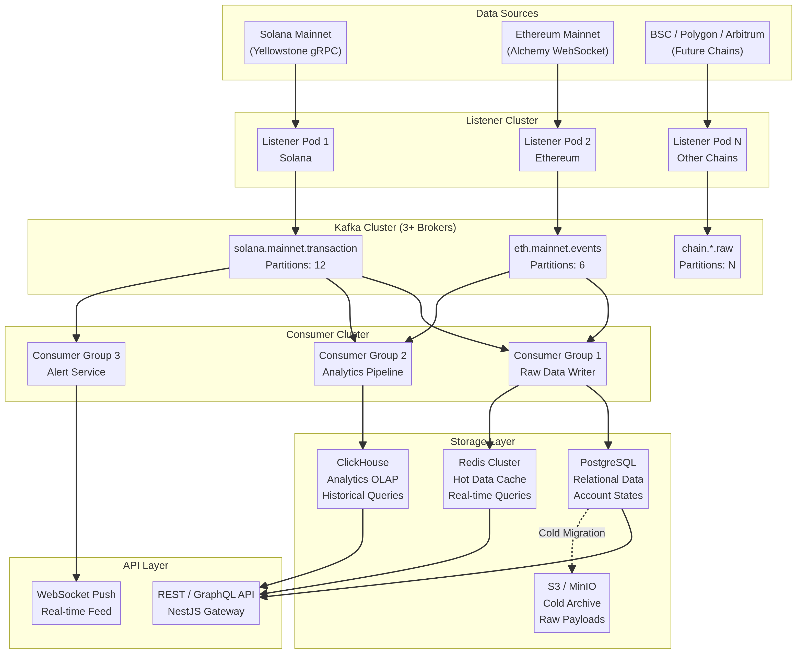
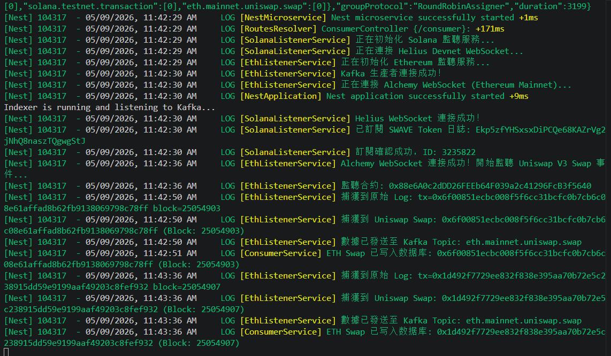
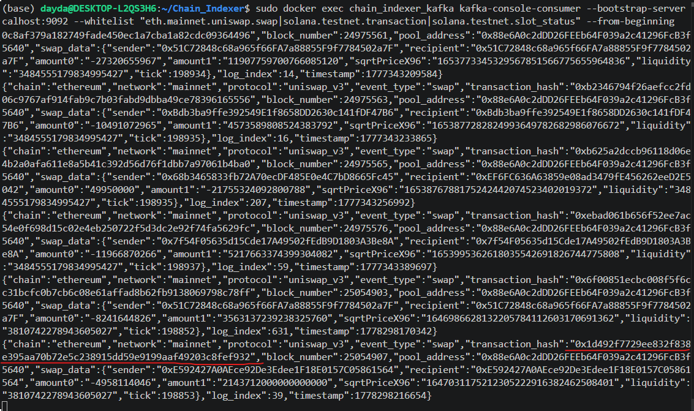
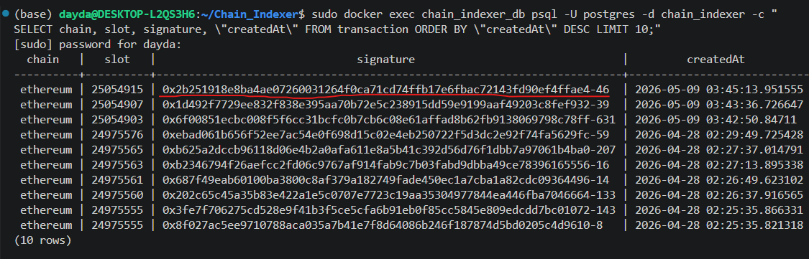
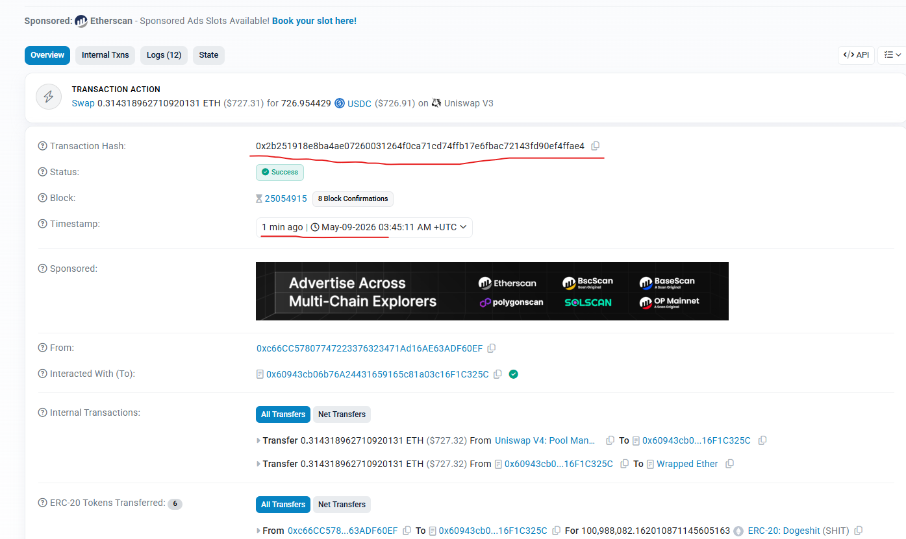
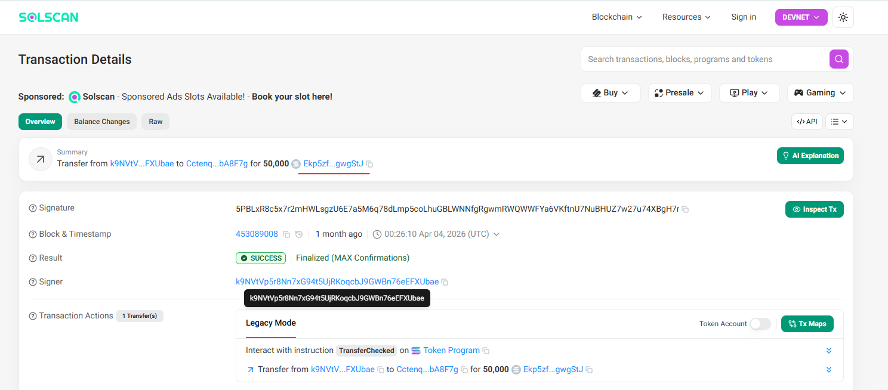

# Chain Indexer

A high-performance, real-time **dual-chain** blockchain data indexing system that transforms raw on-chain data into structured, queryable information. Currently indexing both the **Solana** and **Ethereum** networks, it leverages Helius WebSocket, Alchemy WebSocket, Apache Kafka, NestJS, and PostgreSQL to build a robust, decoupled data pipeline.

---

## Overview

### The Problem

Blockchain data exists on-chain but is not inherently queryable. Developers face challenges:

- **Inaccessibility**: Data requires re-scanning the entire blockchain for queries. RPC nodes are designed for consensus and broadcasting — not complex historical lookups.
- **Latency**: Real-time data access via polling is slow and computationally expensive. DeFi applications (e.g., arbitrage bots) are extremely latency-sensitive and require WebSocket push, not polling.
- **Heterogeneity**: Solana's account model and Ethereum's EVM model have fundamentally different data structures. Upper-layer applications need a unified data view that abstracts away chain-level differences.
- **Scalability**: High-frequency data streams (like Solana's) require robust, distributed processing that can withstand TPS spikes without data loss.

### Our Solution

Chain Indexer acts as a **data bridge** between raw blockchain nodes and upper-layer applications (wallets, dashboards, quant trading bots). It automatically:

1. Monitors Solana (Devnet/Mainnet) via **Helius WebSocket** — subscribing to target token transaction logs (e.g., SWAVE) and capturing transaction signatures and slot numbers.
2. Monitors Ethereum Mainnet via **Alchemy WebSocket** — listening to the most active Uniswap V3 USDC/WETH liquidity pool, capturing and decoding `Swap` events (parties, amounts, liquidity).
3. Normalizes raw data from both chains into a standardized format and streams it to **Apache Kafka** for fully decoupled, high-throughput consumption.
4. Consumes Kafka messages via a **NestJS microservice**, persisting data to **PostgreSQL** with idempotency guaranteed by a `UNIQUE INDEX` on transaction signatures.

---

## Architecture

### Current Architecture (Development / PoC)

> Dual-chain listener → Kafka (5 topics) → NestJS Consumer → PostgreSQL



**Data Flow Breakdown:**

**1. Data Capture — Listener Module (Producer)**

- `SolanaListenerService` and `EthListenerService` each establish a persistent WebSocket connection to Helius and Alchemy respectively on startup.
- When a target on-chain event occurs, the node pushes data proactively.
- The listener performs initial parsing upon receiving raw bytes or JSON — for example, the Ethereum listener uses ABI decoding to parse `topics` and `data` fields from Swap event logs.
- The parsed, standardized object is `emit()`-ed to a specific Kafka topic (e.g., `eth.mainnet.uniswap.swap`).

**2. Message Buffering — Apache Kafka**

- Kafka persists incoming messages to disk, acting as a large durable buffer.
- This guarantees that even if the database write slows down, the real-time listener is never blocked and no data is lost.

**3. Data Consumption & Persistence — Consumer Module**

- `ConsumerController` uses the `@EventPattern` decorator to subscribe to Kafka topics.
- When a new message arrives, the NestJS microservice framework automatically triggers the corresponding handler and passes the message to `ConsumerService`.
- `ConsumerService` maps the data to a `TransactionEntity` and calls TypeORM's `save()` to write to PostgreSQL.
- A `UNIQUE INDEX` on the `signature` field at the database level ensures the same transaction is never written twice (**idempotency**).

```
Solana Network (Devnet/Mainnet)          Ethereum Mainnet
        ↓ Helius WebSocket                    ↓ Alchemy WebSocket
  SolanaListenerService              EthListenerService
  (logsSubscribe)                    (provider.on filter)
        ↓ emit()                             ↓ emit()
               ┌──────────────────────────────┐
               │     Apache Kafka (5 Topics)  │
               └──────────────────────────────┘
                              ↓ @EventPattern
                    ConsumerController
                         ↓
                    ConsumerService (TypeORM)
                         ↓
              PostgreSQL 15 (block / transaction)
```

---

### Production Architecture (Scale-Out Roadmap)

> Listener Cluster → Kafka Cluster (3+ Brokers, partitioned topics) → Consumer Groups → Polyglot Storage → API Layer



When the system moves to production and data volume reaches hundreds of millions of records, the following evolution is required:

**Database — Polyglot Persistence**

| Store | Role | Rationale |
|---|---|---|
| **Redis Cluster** | Hot data / in-memory cache | Sub-millisecond reads for latest block heights, real-time token prices, hot account balance snapshots |
| **PostgreSQL** | Warm data / relational store | Account states, user config, business data requiring strong transactional consistency; horizontally sharded by time or chain |
| **ClickHouse** | Cold-warm data / OLAP warehouse | Columnar storage for massive historical transaction records, contract logs, block metadata; complex aggregation queries orders of magnitude faster than Postgres |
| **S3 / MinIO** | Cold archive / object store | Raw JSON payloads older than 1 year, compressed and archived to minimize storage cost |

**Kafka — Production-Grade Configuration**

- High-traffic topics (e.g., `solana.mainnet.transaction`) set to **12–24 partitions** for parallel consumption.
- Messages keyed by transaction `signature` or account `pubkey` — Kafka routes identical keys to the same partition, **preserving ordering** for state updates.
- Multiple Consumer instances form a **Consumer Group**; Kafka automatically distributes partitions across instances for horizontal scaling.
- Minimum **3 Kafka Broker** nodes with `replication-factor=3` — no data loss on single-node failure.

**High Availability & Fault Tolerance**

- **Listener HA**: WebSocket connections are fragile. Production must configure multiple RPC providers (Alchemy, Infura, QuickNode) with automatic **failover** when the primary node disconnects or exceeds latency thresholds.
- **Reorg Handling**: Blockchains (especially Solana) regularly experience forks and rollbacks. The current PoC writes data directly without handling reorgs. Production adds a `status` field (`processed → confirmed → finalized`) and a mechanism to **mark orphan block transactions as void** when a rollback event is detected.
- **Backpressure**: During on-chain congestion (e.g., hot NFT mints), TPS spikes may overwhelm consumers. The solution is to rely on Kafka's buffering capability and implement **batch inserts** on the consumer side — collecting 1,000 records before issuing a single `INSERT`, dramatically reducing database I/O pressure.

---

## 🎬 Live Demo

The following screenshots capture the system running against **real mainnet / devnet data** — not mocks.

### 1. System Startup — Dual-Chain Listeners Online

Both `SolanaListenerService` (Helius Devnet WebSocket) and `EthListenerService` (Alchemy Mainnet WebSocket) connect successfully on boot. The NestJS microservice registers the Kafka consumer, and the indexer begins capturing live events within milliseconds.



---

### 2. Ethereum — Real Uniswap V3 Swap Events in Kafka

Raw Kafka topic dump (`eth.mainnet.uniswap.swap`) showing decoded Uniswap V3 USDC/WETH swap payloads captured from Ethereum Mainnet in real time — including `sender`, `recipient`, `amount0`, `amount1`, `sqrtPriceX96`, `liquidity`, `tick`, and `log_index`.



---

### 3. PostgreSQL — Recent Transactions Query

Live SQL query against the `transaction` table showing the 10 most recent records indexed from Ethereum Mainnet. Each row carries `chain`, `slot` (block number), full `signature` (tx hash), and `createdAt` timestamp — confirming end-to-end pipeline integrity.



---

### 4. Cross-Verification — Etherscan (Ethereum)

The transaction hash captured by the indexer (`0x2b251918e8ba4ae07260031264f0ca71cd74ffb17e6fbac72143fd90ef4ffae4`) verified directly on Etherscan. Block `25054915`, timestamp `May-09-2026 03:45:11 AM UTC` — an exact match with what PostgreSQL recorded at `2026-05-09 03:45:13`.



---

### 5. Cross-Verification — Solscan (Solana)

A SWAVE token transfer captured on Solana Devnet via Helius WebSocket, verified on Solscan. The token (`Ekp5zf...gwgStJ`) and transaction signature match exactly what the indexer subscribed to and persisted.



---

## Tech Stack

| Layer | Technology | Rationale |
|---|---|---|
| Core Framework | NestJS (Node.js / TypeScript) | Highly modular architecture, dependency injection, and strong microservice support |
| Message Queue | Apache Kafka | Industry-standard high-throughput distributed message queue for blockchain event streams |
| Database | PostgreSQL 15 | Powerful open-source RDBMS with `JSONB` support — ideal for variable-structure transaction `meta` and `data` fields |
| ORM | TypeORM | Deep NestJS integration; strongly-typed database operations and migration management |
| Blockchain SDKs | ethers.js (v6), ws | ABI parsing and Ethereum node interaction; native WebSocket for Solana subscriptions |
| Infrastructure | Docker & Docker Compose | Environment isolation; one-command startup of Postgres, Kafka, and Zookeeper |

---

## Getting Started

### Prerequisites

- Node.js 18+
- Docker and Docker Compose (for Kafka, Zookeeper, and PostgreSQL)
- A **Helius API Key** (Solana RPC/WebSocket)
- An **Alchemy API Key** (Ethereum WebSocket)

### Installation

```bash
git clone https://github.com/wls503pl/Chain_Indexer.git
cd Chain_Indexer/backend

npm install
```

### Environment Setup

1. Start the infrastructure (Kafka, Zookeeper, PostgreSQL) via Docker:

```bash
docker-compose up -d
```

2. Create a `.env` file in the `backend/` directory:

```env
# Database Configuration
DATABASE_HOST=localhost
DATABASE_PORT=5432
DATABASE_USER=postgres
DATABASE_PASSWORD=postgres
DATABASE_NAME=chain_indexer

# Kafka Configuration
KAFKA_BROKER=localhost:9092

# Helius RPC (Solana)
HELIUS_API_KEY=your_helius_api_key_here

# Alchemy (Ethereum)
ALCHEMY_API_KEY=your_alchemy_api_key_here
```

### Running the Application

```bash
# Development mode with hot reload
npm run start:dev

# Production build
npm run build
npm run start:prod
```

---

## Database Query Examples

Data is stored as `jsonb` in PostgreSQL, enabling powerful SQL queries directly against on-chain payloads.

**1. View recent transactions (Signature and Slot):**
```sql
SELECT signature, slot, is_vote
FROM transaction
ORDER BY "createdAt" DESC
LIMIT 5;
```

**2. Extract Fee Payer and Fee from the JSON payload:**
```sql
SELECT
  signature,
  transaction->'message'->'accountKeys'->0 AS fee_payer,
  meta->'fee' AS fee_paid
FROM transaction
WHERE transaction IS NOT NULL
LIMIT 3;
```

**3. Query Ethereum Uniswap Swap events:**
```sql
SELECT
  signature,
  data->>'sender'     AS swap_sender,
  data->>'amount0'    AS amount_token0,
  data->>'amount1'    AS amount_token1
FROM transaction
WHERE chain = 'ethereum'
ORDER BY "createdAt" DESC
LIMIT 10;
```

---

## Project Structure

```text
Chain_Indexer/
└── backend/
    ├── src/
    │   ├── listener/          # Helius & Alchemy WebSocket listeners (Kafka Producers)
    │   │   ├── solana-listener.service.ts
    │   │   └── eth-listener.service.ts
    │   ├── consumer/          # NestJS Kafka Consumer microservice
    │   │   ├── consumer.controller.ts
    │   │   └── consumer.service.ts
    │   ├── transactions/      # Transaction entity and database logic
    │   ├── blocks/            # Block entity and database logic
    │   ├── utils/             # Helper functions
    │   ├── app.module.ts      # Main application module
    │   └── main.ts            # Entry point (starts HTTP server & microservices)
    ├── img/
    │   ├── architecture.png            # Current (PoC) architecture diagram
    │   └── architecture_production.png # Production scale-out architecture diagram
    ├── .env
    ├── package.json
    └── tsconfig.json
```

---

## Current Status & Roadmap

**Currently Implemented:**
- ✅ Real-time Solana Devnet listening via Helius WebSocket (`logsSubscribe`)
- ✅ Real-time Ethereum Mainnet listening via Alchemy WebSocket (Uniswap V3 USDC/WETH Swap events)
- ✅ ABI decoding of Ethereum Swap event `topics` and `data`
- ✅ Kafka producer with topic routing (5 topics across both chains)
- ✅ NestJS Kafka consumer microservice (`@EventPattern`)
- ✅ PostgreSQL persistence via TypeORM with `JSONB` support
- ✅ Idempotent writes via `UNIQUE INDEX` on transaction signatures

**Roadmap (Production Evolution):**
- ⬜ Upgrade Solana listener to Yellowstone gRPC for lower latency and higher reliability
- ⬜ Add `status` field (`processed / confirmed / finalized`) for reorg handling
- ⬜ Introduce Redis for hot data caching
- ⬜ Integrate ClickHouse for historical OLAP queries
- ⬜ Kafka multi-partition configuration with signature-keyed routing
- ⬜ Multi-RPC provider failover for listener HA
- ⬜ Consumer-side batch inserts for backpressure handling
- ⬜ Extend to BSC / Polygon / Arbitrum (additional listener pods)