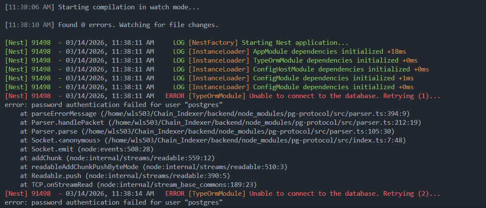
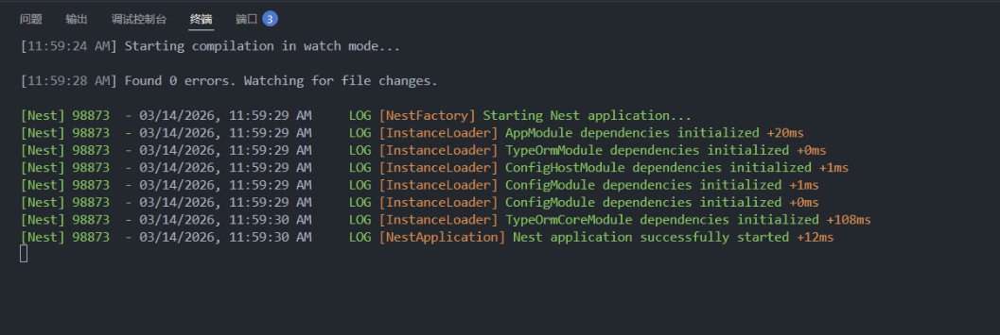

# 問題排查紀錄

---

## 問題：資料庫連線失敗

### 現象

執行 `npm run start:dev` 後，終端機出現資料庫連線錯誤，服務無法啟動。



---

### 原因分析

通常由以下兩種情況之一造成：

**情況一：密碼不一致**
Docker 容器啟動時設定的 `POSTGRES_PASSWORD` 與 NestJS `.env` 檔案中的 `DATABASE_PASSWORD` 不一致。

**情況二：端口被佔用**
本機已有一個 PostgreSQL 進程佔用了 `5432` 端口，Docker 容器嘗試綁定同一端口時衝突。

---

### 解決步驟

#### 1. 統一密碼

確保 `.env` 與 `docker-compose.yaml` 中的密碼完全一致，統一改為 `postgres`：

```bash
sed -i 's/DATABASE_PASSWORD=.*/DATABASE_PASSWORD=postgres/' ~/Chain_Indexer/backend/.env
sed -i 's/DATABASE_USER=.*/DATABASE_USER=postgres/' ~/Chain_Indexer/backend/.env
```

#### 2. 強制重置資料庫資料卷

舊的 Docker Volume 可能保留了舊密碼，需徹底清除後重新啟動：

```bash
cd ~/Chain_Indexer/backend
docker compose down -v   # 停止容器並刪除資料卷
docker compose up -d     # 重新啟動
```

#### 3. 處理端口衝突（若出現 `address already in use`）

查詢佔用 5432 端口的進程：

```bash
sudo ss -tlnp | grep 5432
```

停止本機 PostgreSQL：

```bash
sudo systemctl stop postgresql
docker compose up -d
```

> 本機 PostgreSQL 與 Docker 中的是兩個獨立實例，同時運行容易混淆，建議開發期間只保留 Docker 版本。

---

### 解決後

依序執行上述步驟後，重新啟動開發伺服器：

```bash
npm run start:dev
```


