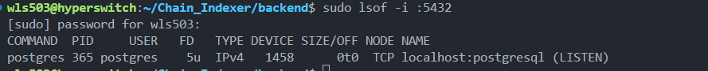
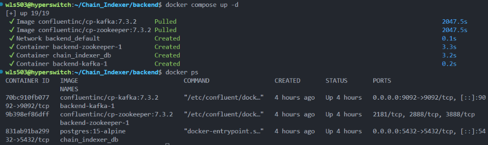
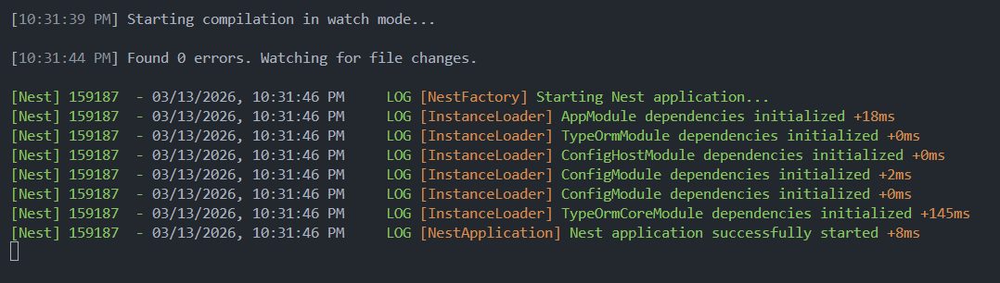

# 本地後端環境安裝指南

## 引言

配置開發環境是每一位開發者都曾深陷其中的泥潭。看似只是「裝幾個套件、跑幾行命令」的小事，實際上往往耗去數小時，甚至數天——版本不相容、端口被佔用、映像拉取失敗、服務起不來……各種莫名其妙的問題接連而來，讓人抓狂。

這篇文件記錄了本地後端（backend）環境的完整安裝過程，以及在實際操作中踩過的每一個坑，希望能讓後來者少走彎路，少喝幾杯咖啡撐到天亮。

---

## 一、前置確認：檢查 Docker 與 Node 是否已安裝

在開始之前，先確認本機是否已具備必要的執行環境：

```bash
docker --version
node --version
```

若兩者均正常輸出版本號，即可繼續。否則請先完成安裝再進行後續步驟。

---

## 二、安裝 NestJS CLI 並初始化後端專案

```bash
npm install -g @nestjs/cli
nest new backend --package-manager npm
```

此步驟會建立一個名為 `backend` 的 NestJS 專案骨架，並使用 npm 作為套件管理器。

---

## 三、進入 backend，安裝專案依賴

```bash
cd backend
npm install @nestjs/microservices @nestjs/typeorm @nestjs/config typeorm pg kafkajs @solana/web3.js class-transformer class-validator
```

以上依賴涵蓋微服務通訊、資料庫 ORM（TypeORM + PostgreSQL）、Kafka 消息佇列、Solana Web3 SDK 以及資料驗證等核心模組。

---

## 四、建立 `.env` 環境變數檔案

在 `backend` 根目錄執行以下命令，建立環境變數設定檔：

```bash
cat > .env << 'EOF'
DATABASE_HOST=localhost
DATABASE_PORT=5432
DATABASE_USER=postgres
DATABASE_PASSWORD=postgres
DATABASE_NAME=chain_indexer
KAFKA_BROKER=localhost:9092
EOF
```

此檔案定義了 PostgreSQL 與 Kafka 的連線資訊，後續 NestJS 會透過 `ConfigService` 讀取。

---

## 五、準備本地運行環境（Docker Compose）

為了讓後端能夠正常啟動，需要在本機同時運行 **PostgreSQL** 和 **Kafka**（含其依賴的 Zookeeper）。

在 `backend` 目錄下建立 `docker-compose.yaml` 檔案：

```yaml
version: '3.8'

services:
  postgres:
    image: postgres:15-alpine
    container_name: chain_indexer_db
    environment:
      - POSTGRES_USER=postgres
      - POSTGRES_PASSWORD=postgres
      - POSTGRES_DB=chain_indexer
    ports:
      - '5432:5432'
    volumes:
      - postgres_data:/var/lib/postgresql/data

  zookeeper:
    image: confluentinc/cp-zookeeper:latest
    environment:
      - ZOOKEEPER_CLIENT_PORT=2181
      - ZOOKEEPER_TICK_TIME=2000

  kafka:
    image: confluentinc/cp-kafka:latest
    depends_on:
      - zookeeper
    ports:
      - '9092:9092'
    environment:
      - KAFKA_BROKER_ID=1
      - KAFKA_ZOOKEEPER_CONNECT=zookeeper:2181
      - KAFKA_ADVERTISED_LISTENERS=PLAINTEXT://localhost:9092
      - KAFKA_LISTENER_SECURITY_PROTOCOL_MAP=PLAINTEXT:PLAINTEXT
      - KAFKA_INTER_BROKER_LISTENER_NAME=PLAINTEXT
      - KAFKA_OFFSETS_TOPIC_REPLICATION_FACTOR=1

volumes:
  postgres_data:
```

完成後執行以下命令啟動服務：

```bash
sudo docker-compose up -d
```

---

## 六、排錯：Docker 映像拉取失敗（國內網路問題）

> **問題描述**：Docker Hub 官方映像源（`registry-1.docker.io`）在部分網路環境下無法穩定存取，導致拉取映像時出現 `connection refused` 錯誤。

**解決方案：配置 Docker 映像加速器**

建立或修改 Docker 的 daemon 設定檔：

```bash
sudo mkdir -p /etc/docker
sudo tee /etc/docker/daemon.json <<-'EOF'
{
  "registry-mirrors": [
    "https://mirror.baidubce.com",
    "https://hub-mirror.c.163.com",
    "https://docker.m.daocloud.io"
  ]
}
EOF
```

重新啟動 Docker 服務使設定生效：

```bash
sudo systemctl daemon-reload
sudo systemctl restart docker
```

再次嘗試啟動容器：

```bash
cd ~/Chain_Indexer/backend
docker compose up -d
```

---

## 七、排錯：端口 5432 已被佔用

> **錯誤訊息**：
>
> ```
> Error response from daemon: failed to set up container networking: driver failed programming external
> connectivity on endpoint chain_indexer_db (...): failed to bind host port for 0.0.0.0:5432:172.18.0.2:5432/tcp:
> address already in use
> ```

**原因分析**：本機的 PostgreSQL 服務正在運行，與 Docker 容器競爭同一端口（5432）。

首先確認是誰佔用了端口：

```bash
sudo lsof -i :5432
```

如下圖所示，可以看到是本機的 PostgreSQL 服務佔用了該端口：



**解決方案**：停止本機 PostgreSQL 服務，將端口讓給 Docker 容器使用：

```bash
sudo systemctl stop postgresql
```

再次強制重建並啟動容器：

```bash
docker compose up -d --force-recreate
```

如下圖所示，PostgreSQL、Kafka 以及對應的 Zookeeper 均已正常啟動：



---

## 八、配置 NestJS 連接資料庫

讓 NestJS 能夠連上剛才啟動的 PostgreSQL。需要修改 `src/app.module.ts`，在 `backend` 目錄下執行以下命令：

```bash
cat > src/app.module.ts << 'EOF'
import { Module } from '@nestjs/common';
import { ConfigModule, ConfigService } from '@nestjs/config';
import { TypeOrmModule } from '@nestjs/typeorm';

@Module({
  imports: [
    ConfigModule.forRoot({
      isGlobal: true,
    }),
    TypeOrmModule.forRootAsync({
      imports: [ConfigModule],
      useFactory: (configService: ConfigService) => ({
        type: 'postgres',
        host: configService.get<string>('DATABASE_HOST'),
        port: configService.get<number>('DATABASE_PORT'),
        username: configService.get<string>('DATABASE_USER'),
        password: configService.get<string>('DATABASE_PASSWORD'),
        database: configService.get<string>('DATABASE_NAME'),
        autoLoadEntities: true,
        synchronize: true, // 開發環境開啟，自動同步資料庫表結構
      }),
      inject: [ConfigService],
    }),
  ],
})
export class AppModule {}
EOF
```

---

## 九、啟動後端，驗證資料庫連線

執行以下命令以開發模式啟動後端：

```bash
npm run start:dev
```

如下圖所示，後端成功連上資料庫，本地後端環境配置完成：



---

## 總結

至此，本地後端環境已完整配置完畢。整個過程涉及的核心組件如下：

| 組件       | 版本/映像                          | 端口 |
| ---------- | ---------------------------------- | ---- |
| PostgreSQL | `postgres:15-alpine`               | 5432 |
| Kafka      | `confluentinc/cp-kafka:latest`     | 9092 |
| Zookeeper  | `confluentinc/cp-zookeeper:latest` | 2181 |
| NestJS     | 最新 CLI 版本                      | 3000 |
